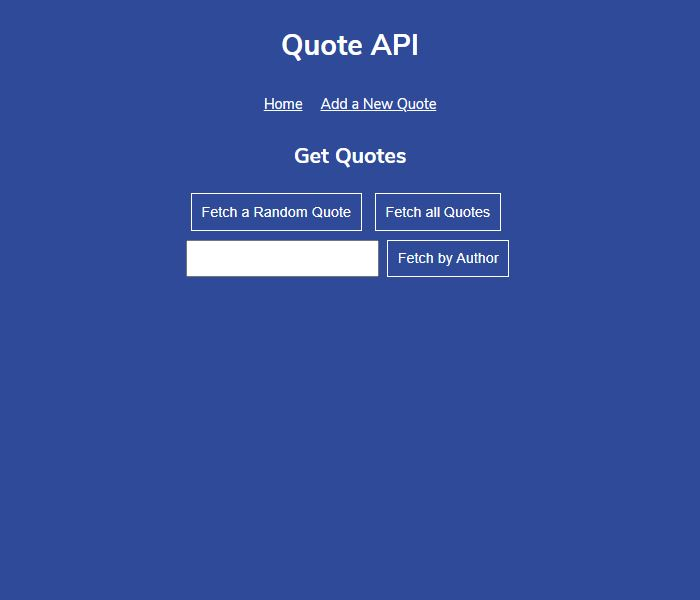

# Quote API

Quote API is one of Codecademy's open-ended projects, in which it is encouraged to problem solve and utilize other resources, instead of being provided with step-by-step guidance. The requirements were to build a small Express.js JSON web API to store and serve different quotes about computers, coding, and technology. We were given some starter code in the form of a front-end site and some Express.js boilerplate, and were instructed to build several route handlers to serve up famous and interesting quotes. It was suggested that we test out the functionality by interacting with our front-end or with a tool like Postman. I also chose to extend the app's functionality by adding put and delete routes, and by inserting additional data into the provided quotes array and modifying the front-end code to accomodate the changes.

## Table of Contents

- [Technologies](#technologies)
- [Screenshots](#screenshots)
- [Status](#status)

## Technologies

This project was created with:

- JavaScript ES6
- Node.js version: 14.15.1
- Express.js version: 4.17.1

## Screenshots

## Status

This project has been completed.